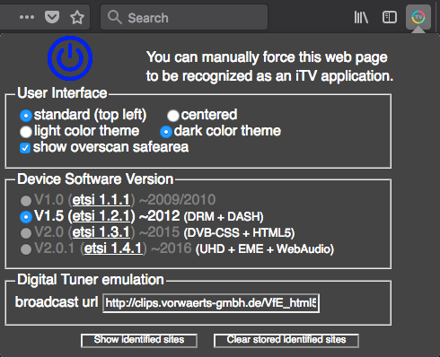

# HybridTvViewer  [](https://github.com/karl-rousseau/HybridTvViewer/blob/master/LICENSE)

Embracing such Hybrid Interactive TV Technologies:

 &nbsp;&nbsp;&nbsp;  &nbsp;&nbsp;&nbsp; 

## Preamble

```
This browser extension mimics the behavior of the good one called FireHbbTV available only for FIREFOX
```
Please note that I have decided to do this extension during my spare time. I also wanted to avoid the default action of our browsers which is to download such iTV (interactive television) application pages.

| Browser: | Mozilla Firefox (V57+) | Opera (chrome based) | Google Chrome | Microsoft Edge | Apple Safari |
| -------- | -------- | ------- | ------ | ------ | ------ |
| Extension: | [](https://addons.mozilla.org/en-US/firefox/addon/hybridtvviewer/) | free (publishing stuck) | not free (5$ fee) | not free (19$ fee) | no support for [Web Extensions](https://developer.mozilla.org/en-US/Add-ons/WebExtensions) yet |
| Codec [H.264](https://caniuse.com/#feat=mpeg4): | yes (plugin by Cisco) | yes | yes | yes | yes |
| Codec [H.265](https://caniuse.com/#feat=hevc): | no | no | [yes here](https://github.com/henrypp/chromium/releases) (win10) | yes (win10) | yes (MacOS 10.13+) |

## Screenshot



## Features

| Feature            | Description |
| ------------------ | ----------- |
| auto-detection     | an analysis of HTTP server headers plus inside header & meta tags is performed |
| forced detection   | user on-clicked power button will force iTV emulation (auto-saved in web extension local storage) |
| bottom bar  | underneath the screen rendering, the emulator is providing some buttons (colored keys, resolutions for zoomed rendering, ...) |
| iDTV customization | the extension enables customization of various parameters (user-agent, OIPF capabilities, country, CAS id, DVB channels, ...) |
| external inputs | it handles some external inputs such as CI+ APDU reply message, Stream-Event content customization & triggering, DVB channels with customized LCN, ... |
| video support | it will handle the rendering of browser unrecognized broadcast video stream: Mpeg-TS and Mpeg-DASH (with the help of an external library) |

## Usage

You can use the arrow keys <kbd>&leftarrow;</kbd>,<kbd>&rightarrow;</kbd>,<kbd>&uparrow;</kbd>,<kbd>&downarrow;</kbd>, <kbd>enter</kbd> and <kbd>backspace</kbd> keys to navigate inside the emulated iTV application.  
Colored keys are also mapped to <kbd>R</kbd>, <kbd>G</kbd>, <kbd>B</kbd> and <kbd>Y</kbd> keyboard keys.

## Examples

The purpose of this extension is mainly to validate the **MIT-xperts test suite** under CHROME and FIREFOX.  
Here are some example URL that have been extracted from various sources:

| Name          | Source | URL |
| ------------- | ------ |---- |
| MIT-xperts HbbTV test suite | [TS stream](https://github.com/mitxp/HbbTV-Testsuite/wiki) | http://itv.mit-xperts.com/hbbtvtest/ |
| ARTE HbbTV    | French DTT TS | http://www.arte.tv/hbbtvv2/index.html |
| ARTE CE-HTML  | Philips iDTV portal | http://cehtml.arte.tv/de/2764896.cehtml |
| ...           |

More examples (with dead ones) can be found on this application catalog: http://urju.de/hbbtv/

## Dependencies

This project is not modifying those libraries and only doing a dynamic dependency call at runtime on their CDN releases.
- [DASH.js 2.0](https://github.com/Dash-Industry-Forum/dash.js): reference client to decode DASH manifest files and provide DASH segments to HTML5 EME video player
  * Copyright 2015 Dash Industry Forum with BSD license
- [MUX.js](https://github.com/videojs/mux.js): useful library to transmux Mpeg-TS to MP4 on the fly
  * Copyright 2015 Brightcove with APACHE 2.0 license

## Abbreviations

- iTV: Interactive TeleVision
- iDTV: Integrated Digital TeleVision
- CI+: Common Interface
- HLS: HTTP Live Streaming
- DASH: Dynamic Adaptive Streaming over HTTP
- DVB: Digital Video Broadcasting
- DVB-T: Digital Video Broadcasting Terrestrial
- DVB-C: Digital Video Broadcasting Cable
- DVB-S: Digital Video Broadcasting Satellite
- DVB-SI: DVB Service Information
- AIT: Application Information Table
- EIT: Event Information Table
- LCN: Logical Channel Number

## References

- MHP (Multimedia Home Platform) : Based on SUN JAVA technology working on [GEM-MHP](https://en.wikipedia.org/wiki/Globally_Executable_MHP) middleware
  * initialy defined by [ETSI TS 101 812](http://www.etsi.org/deliver/etsi_ts/101800_101899/101812/01.02.01_60/ts_101812v010201p.pdf) documentation
- **HbbTV** (Hybrid Broadband Broadcast TeleVision) :
  * defined by current [ETSI TS 102 796 V1.3.1](http://www.etsi.org/deliver/etsi_ts/102700_102799/102796/01.03.01_60/ts_102796v010301p.pdf) specifications (aka HbbTV V2.0)
    * bringing **HTML5 video tag** notation within [HbbTV V2.0 only](https://www.hbbtv.org/resource-library/#specifications)
  * following old MHP AITX structure
  * handling some CEA-2014 notations
  * implementing a subset of OIPF objects
- OHTV (Open Hybrid TV) : similar to HbbTV and used for example at [iCON TV](http://able.kbs.co.kr/enter/tal_view.php?mseq=16&pcg=&pgseq=&no=270211) in KOREA by the national broadcaster *KBS* since 2010
- BML (Broadcast Markup Language) : similar to HbbTV and defined by ARIB STD B-24 standard used in JAPAN over ISDB-T broadcasted channels like [*NHK*](https://www.nhk.or.jp/strl/publica/bt/en/fe0003-1.html)
- CE-HTML (Consumer Electronics HTML) : nowadays less used and only found on old devices
- OIPF (Open IPTV Forum) : used on some STB. Since 2014 activities have been transfered to HbbTV association
- ATSC (Advanced Television Systems Committee) : broadcast standard in US where [ATSC V3](https://www.atsc.org/standards/atsc-3-0-standards/) follows HbbTV V2
